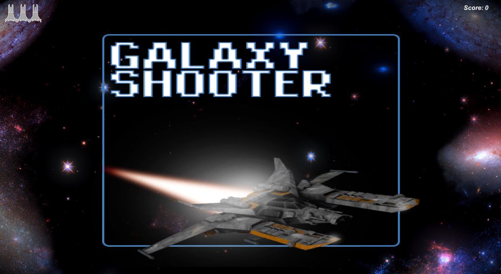
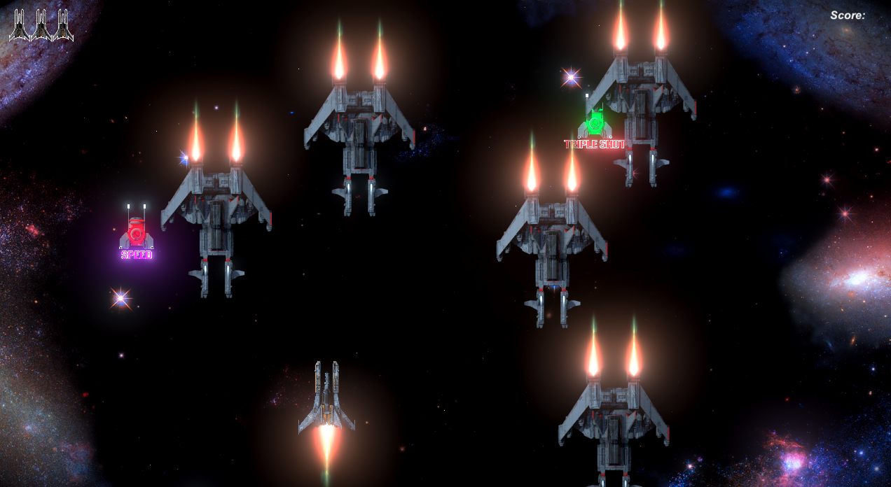

## Overview 
<div>
 
 
</div>

## About
This project was developed during the course "__[O Guia Definitivo para Desenvolvimento de Jogos com Unity](https://www.udemy.com/course/o-guia-definitivo-para-desenvolvimento-de-jogos-com-unity/)__" to study and understand the basic concepts about the Unity.

## Technologies 
This project was built with:
- [Unity](https://unity.com/)
 
## Contribute
 1. Fork this repository;
 2. Create a branch with your feature: ```git checkout -b my-feature```
 3. Commit your changes: ```git commit -m 'feat: My new feature'```
 4. Push your branch: ```git push origin my-feature```
 
## License
This project is under the MIT license. Take a look at the [LICENSE](LICENSE.md) file for more details.
